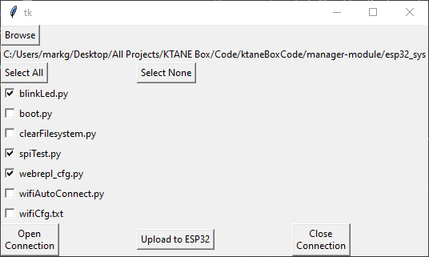

# micropython-uploader
This is a tool to upload code to the ESP32 via WebREPL  
Created by Mark Gilliland March 2022  

## Dependancies
uses the webrepl tool for micropython, found at https://github.com/micropython/webrepl
Also uses Python 3.9 with Tkinter

## ToDo List:
* Make GUI pretty (resizing, better labels, better phrasing, padding)
* Grey out options until they make sense
  * Some things depend on a connection
  * Some things depend on a directory being picked
* Add a progress bar
* Make IP address selectable
* Add graceful failure if connection is not possible
* Use pyinstaller to make an executable